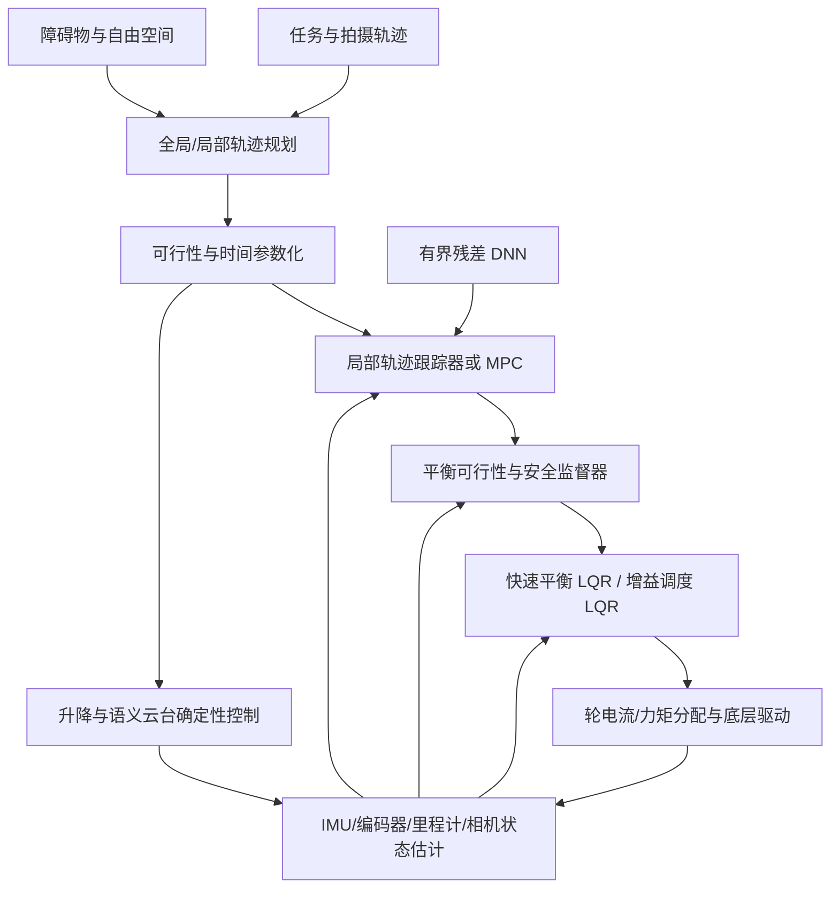

# 两轮自平衡升降摄影机器人完整 PNC 框架说明

> 日期：2026-07-16  
> 文档状态：架构基线与阶段性实施路线  
> 当前范围：无机械臂、带升降立柱和 DJI 云台的两轮自平衡摄影机器人  
> 核心任务：保持平衡、跟踪相机位姿轨迹、未来实现碰撞规避

## 1. 文档目的

本文面向控制、机器人学习、仿真、嵌入式和产品团队，统一说明：

- 当前正在实现和验证什么；
- 为什么当前尚未进入 PPO 训练；
- LQR、MPC、强化学习和避障规划分别负责什么；
- 如何逐步形成完整、可部署、可验证的 PNC（Planning, Navigation and Control）框架；
- 每一步需要满足哪些门禁，失败后如何递归改进，而不是盲目继续训练。

本文描述的是目标架构和当前工程基线，不代表所有模块都已经完成或已经具备实机部署资格。

## 2. 机器人与任务合同

### 2.1 当前机器人形态

| 项目 | 当前合同或假设 |
|---|---|
| 底盘 | 两轮差速、自平衡、无脚轮 |
| 暂定整机质量 | 约 28 kg，后续以实测值更新 |
| 两轮中心距 | 0.620 m |
| 轮径 | 8 英寸，即 0.2032 m |
| 轮半径 | 0.1016 m |
| 上装 | 无三关节机械臂 |
| 升降机构 | 相机高度约 0.6-1.8 m |
| 升降目标速度 | 最大约 1.0 m/s |
| 相机执行端 | 物理 `cam_link` / 相机光心 |
| 云台 | DJI RS4/RS5 类语义姿态控制接口 |
| 轨迹数据 | 修正后的 79 条无障碍相机位姿轨迹 |

升降速度、整机质量、质心、惯量、轮胎摩擦、轮电机峰值电流和控制延迟仍包含工程假设。进入实机控制前必须由测量结果替换，并重新运行鲁棒性门禁。

### 2.2 云台和相机坐标合同

强化学习和 PNC 不应把 DJI 云台物理电机关节角当作产品控制接口。产品侧控制量是相机/云台的语义姿态指令，由 DJI 自身控制器完成内部电机分配。

当前合同为：

```text
R_world_cam = R_world_DFR * Rz(+pi/2)
```

- 轨迹目标使用语义 DFR 相机姿态；
- 观测和奖励使用物理 `cam_link` 的 FK/仿真状态；
- 云台姿态由确定性语义适配器处理；
- 学习策略不输出 DJI 物理云台轴角；
- 已确认存在姿态转置或物理云台索引错误的旧教师数据不得重新进入训练集。

## 3. 总体目标与优先级

完整系统需要同时完成三个业务目标：

1. 保持两轮机器人稳定和平衡；
2. 使物理相机执行端跟踪给定的位置和姿态轨迹；
3. 在未来加入障碍物后，绕开障碍并尽可能保持原始拍摄轨迹意图。

这些目标不是同等优先级。系统必须采用严格的字典序优先级：

```text
故障处置与人员/设备安全
> 平衡与有限状态
> 升降机构、轮电机和云台约束
> 碰撞规避与可恢复空间
> 相机轨迹完成度
> 轨迹精度
> 平滑性、能耗和拍摄质量
```

当轨迹跟踪与平衡冲突时，必须降低轨迹进度或停止，而不是为了减小跟踪误差继续执行危险动作。

## 4. 当前阶段已经具备的基础

### 4.1 已建立的机器人与控制基线

- 已采用 0.620 m 轮距和 8 英寸轮径的两轮升降机器人模型；
- 当前仿真假设总质量约 28 kg；
- 内层采用确定性平衡 LQR/级联控制器；
- 外层使用有界 `vx/wz` 跟踪和轨迹进度 governor；
- 升降目标和语义云台姿态通过确定性执行链路处理；
- 已有修正后的 79 条无障碍相机轨迹和对应纯运动学计划；
- 训练动作合同已收敛为高层残差：`[delta_vx, delta_wz, delta_riser]`；
- 平衡 LQR 不交给策略任意覆盖，学习策略只能在受限包络内修正高层命令。

### 4.2 当前验证状态

截至本文快照：

- 纯运动学层面的 79 条轨迹计划已经可用；
- Isaac 动态数据采集曾完成 case 1-14；
- case 15 暴露了持续位置误差，触发 fail-fast 停止；
- 初始动态位置 p95 约为 `0.209 m`，高于 `0.150 m` 门限；
- 修复“相位 governor 降速但 feedforward 未同步缩放”问题后，p95 约降至 `0.191 m`；
- 将外层 along-track 增益从 `0.8` 提高到 `1.2` 后，p95 约降至 `0.165 m`；
- 上述改进没有观察到动作饱和或平衡安全回退；
- `0.165 m` 仍未达到 `0.150 m` 门限，因此尚不能宣布全 79 动态基线通过；
- PPO 当前仍处于禁止状态。

这些数字是阶段性诊断快照，不应当被描述为最终全 79 结果。

### 4.3 当前阶段的真实含义

目前不是“训练 PPO 提升性能”的阶段，而是建立可训练、可比较的确定性基线：

- 内层 LQR 必须先证明能够稳定机器人；
- 外层跟踪器必须完成足够多的轨迹，才能生成有效执行数据；
- 所有 feedforward、phase governor 和教师残差标签必须遵守同一时间尺度；
- 数据只能来自完整通过动态门禁的轨迹执行；
- 学习策略必须与零残差和冻结 LQR 基线比较，而不是只看训练 loss。

## 5. 建议的完整 PNC 分层架构



### 5.1 层 0：驱动与故障安全

职责：

- 轮电机电流/力矩闭环；
- 电流、速度、温度和电压限制；
- 通信 watchdog；
- 急停和 fault landing；
- 高频 IMU、编码器和电机遥测；
- 黑匣子日志。

这一层必须由实时控制器拥有，不能依赖 Linux 用户态策略及时介入。

### 5.2 层 1：状态估计

建议状态至少包括：

```text
车体 pitch / pitch_rate
底盘 yaw / yaw_rate
左右轮角度与角速度
底盘 vx / vy 估计
世界坐标位置与航向
升降高度与速度
整机质心或平衡偏置估计
物理 cam_link 位姿
控制延迟和执行器健康状态
```

仿真可以直接读取真值，但训练和部署观测必须逐步切换到实机可获得的估计量，并注入真实噪声、延迟和丢包。

### 5.3 层 2：快速平衡控制

当前建议继续采用快速 LQR 作为内层稳定器：

- 典型频率：200-500 Hz，实机条件允许时可更高；
- 控制对象：车体 pitch、pitch rate、轮运动和 yaw 动态；
- 输入：有界 `vx/wz` 请求；
- 输出：左右轮归一化力矩、电流或等效动作；
- 必须具有 anti-windup、限幅、命令 slew limit 和故障状态机。

LQR 的目标是建立局部稳定域，不是独自解决所有轨迹跟踪和避障问题。

### 5.4 层 3：安全监督和可行性过滤

所有规划器、MPC 和学习策略的命令都必须经过这一层。建议约束包括：

- 最大 pitch、pitch rate 和预计倒地时间；
- 轮电机峰值/连续力矩和电流；
- 制动距离和可恢复空间；
- 升降高度、速度、加速度和机械限位；
- 云台语义姿态和速率限制；
- 最小障碍距离；
- 学习残差的幅值、变化率和持续时间。

后续可以评估 CBF、reference governor 或短时可达集作为安全过滤器，但第一版应保持简单、确定性和可审计。

### 5.5 层 4：轨迹跟踪控制

当前实现是确定性几何跟踪器加 phase governor：

- 将相机轨迹转换为底盘、升降和语义云台参考；
- 根据实际误差生成有界 `vx/wz`；
- 当平衡或位置误差增大时降低轨迹 phase 进度；
- 所有轨迹导数必须按 phase progress 同比例缩放；
- 不允许目标时间变慢但仍发送原始全速 feedforward。

当前工作重点是让冻结的确定性基线完成全 79 动态门禁，而不是把跟踪器无限调到最优。

### 5.6 层 5：MPC 候选层

MPC 最适合放在慢速外层，而不是立即替代快速平衡 LQR。它可以显式处理：

- 未来一段时间内的 pitch 和轮力矩约束；
- `vx/wz`、升降速度和加速度约束；
- 急转弯、方向反转和轨迹时间参数化；
- 质心随升降高度变化；
- 障碍物距离、通道宽度和制动空间；
- 跟踪误差、控制平滑和拍摄质量之间的代价权衡。

推荐初始结构：

```text
20-50 Hz 线性时变 MPC 或非线性 MPC
        -> 有界 vx/wz/riser 请求
200-500 Hz LQR
        -> 左右轮力矩/电流
```

只有在冻结 LQR 基线可靠后，才能公平比较“几何外环”和“MPC 外环”。

### 5.7 层 6：学习策略

第一阶段学习策略不直接输出轮力矩。推荐动作仍为：

```text
action = [delta_vx, delta_wz, delta_riser]
```

建议职责：

- 补偿模型误差、延迟和轮胎非线性；
- 在冻结 LQR 保证局部稳定的前提下改善跟踪；
- 学习不同轨迹族、升降高度和动态条件下的高层修正；
- 后续为 MPC 提供 residual、代价权重或 warm start，但不能绕过安全层。

推荐训练顺序：

1. 使用通过门禁的确定性执行数据进行 BC/监督预训练；
2. 在 case-disjoint 验证集上比较零残差基线；
3. 通过离线门禁后进行短时闭环 rollout；
4. 只有安全和跟踪均无回退时，才考虑 bounded PPO fine-tuning；
5. PPO 只优化冻结控制器之上的残差，不从零接管轮力矩。

## 6. LQR、MPC 和 RL 的职责边界

| 方法 | 最适合解决的问题 | 不应承担的全部责任 |
|---|---|---|
| LQR | 高频局部平衡、确定性稳定、低计算开销 | 非线性大范围规划、障碍规避、复杂约束预测 |
| MPC | 预测控制、约束处理、轨迹与避障协调 | 替代所有高速故障安全和底层电流保护 |
| BC/IL | 从高质量教师快速获得合理初始策略 | 修复错误教师、保证闭环稳定 |
| PPO/RL | 补偿难建模动态、提升残差策略 | 从零学习全部安全行为并直接承担实机安全 |
| CBF/安全过滤 | 在线阻止不可接受动作 | 生成完整高质量拍摄轨迹 |

因此，目标不是在 LQR、MPC 和 RL 中选择唯一方法，而是形成分层组合：

```text
安全监督 + 快速 LQR + 外层跟踪/MPC + 有界学习残差
```

## 7. 碰撞规避的未来接入方式

### 7.1 障碍感知合同

规划层应接收下列一种或多种表达：

- 2D occupancy grid；
- 局部 costmap；
- signed distance field；
- 参数化圆柱、圆盘、箱体和墙面；
- 动态障碍物的位置、速度和不确定度。

感知和规划必须使用与底盘、相机轨迹一致的时间戳和坐标系。

### 7.2 避障不是简单奖励项

仅在 PPO reward 中加入碰撞惩罚通常不够。完整避障至少包含：

- 规划器生成无碰撞候选路径；
- 局部控制器保证制动距离和可恢复空间；
- 安全层执行硬最小间距；
- RL 只在允许空间内改善平滑性和跟踪折中。

### 7.3 障碍课程建议

| 阶段 | 场景 | 目标 |
|---|---|---|
| O0 | 无障碍 79 条轨迹 | 建立平衡和轨迹跟踪基线 |
| O1 | 单个静态圆柱/圆盘 | 学会小幅绕行并恢复原轨迹 |
| O2 | 随机单障碍 | 提升位置、尺寸和侧向随机化能力 |
| O3 | 两个静态障碍 | 学习通道选择和局部重规划 |
| O4 | 狭窄通道和不可行场景 | 学会减速、停止和明确失败 |
| O5 | 动态障碍 | 加入预测、让行和重新接轨 |

障碍尺寸应参数化。可以用直径约 0.4 m、高度约 0.5 m 的圆柱作为第一类代表障碍，但不能把策略只训练成适配单一尺寸。

## 8. 递归改进机制

每一轮只攻击当前最高优先级的失败门禁：

1. 选择当前最高优先级失败项；
2. 提出一个可证伪的根因假设；
3. 每轮只修改一个结构因素；
4. 先运行单元测试和纯合同测试；
5. 再运行一个或少量代表性 Isaac case；
6. 代表 case 通过后才恢复全阶段运行；
7. 与冻结基线逐项比较；
8. 任一更高优先级指标回退则拒绝候选；
9. 保存参数、commit、随机种子、结果 JSON、日志和视频；
10. 将胜出候选升级为下一轮冻结基线。

禁止做法：

- 在门禁失败时直接延长 PPO 训练；
- 同时修改模型、奖励、控制器和轨迹，导致无法归因；
- 只看平均 reward，不看逐 case 安全与完成度；
- 使用失败、截断或合同错误的轨迹作为主要 BC 教师；
- 放宽门限以制造“通过”；
- 用仿真真值观测训练出实机无法部署的策略。

## 9. 建议实施路线

### 阶段 P0：确定机器人和物理合同

完成条件：

- 轮距、轮径、质量和关节拓扑正确；
- 无机械臂残留 DOF；
- 升降范围和速率限制正确；
- 相机与语义云台坐标合同正确；
- 被动倒地、力矩方向和接触行为正确。

### 阶段 P1：冻结平衡 LQR

完成条件：

- 静止和平移/转向命令下保持稳定；
- 多个升降高度下稳定；
- 无持续饱和；
- 质量、摩擦、延迟、质心扰动下满足生存和恢复门禁；
- 输出接口稳定为有界 `vx/wz -> wheel effort/current`。

### 阶段 P2：确定性全 79 轨迹门禁

完成条件：

- 79 条轨迹全部完成；
- 无跌倒和非有限状态；
- 相机位置 p95 不超过 0.15 m；
- 相机位置最大误差不超过 0.25 m；
- 姿态 p95 不超过 5 deg；
- 姿态最大误差不超过 10 deg；
- 升降和云台误差、速度、力矩及饱和率均受限。

### 阶段 P3：残差数据与 BC

完成条件：

- 只收集动态门禁通过的执行数据；
- 79 条轨迹具有 case-disjoint train/validation/holdout 划分；
- 观测、动作、时间尺度和相机坐标合同一致；
- BC 在各动作通道上优于零残差基线；
- TorchScript/部署模型能够确定性复现。

### 阶段 P4：有界 RL 微调

进入条件：P0-P3 全部通过。

完成条件：

- 闭环性能优于冻结 LQR/BC；
- 安全、完成度和 holdout 无回退；
- 策略动作在包络内；
- 随机化和未见轨迹上保持稳定；
- 失败时能够自动切回确定性控制器。

### 阶段 P5：MPC 对比和集成

触发条件：

- 确定性外环在急转、反向、升降耦合或约束处理上持续成为瓶颈；
- 单纯增加反馈增益导致振荡、饱和或鲁棒性下降；
- 需要显式控制未来制动距离或障碍约束。

需要比较：

- 几何跟踪器 + LQR；
- MPC + LQR；
- 几何跟踪器 + LQR + residual DNN；
- MPC + LQR + residual DNN。

### 阶段 P6：障碍物课程

进入条件：无障碍 79 条轨迹的安全和跟踪基线已经稳定。

完成条件：

- 无碰撞和最小间距门禁通过；
- 机器人不会为了跟踪原轨迹进入不可恢复姿态；
- 绕行后能够重新接近原拍摄轨迹；
- 不可行场景能够安全减速、停止并报告失败。

### 阶段 P7：Sim-to-Real 和实机验证

完成条件：

- 使用实测质量、质心、惯量、摩擦、轮电机参数和延迟；
- 完成 SIL、HIL、吊架、低速和受控场地测试；
- 每一级测试都有急停、旁路和回退控制器；
- 仿真门禁和实机门禁使用一致的数据合同；
- 未完成前不得直接在开放环境运行学习策略。

## 10. 关键验收指标

### 10.1 平衡安全

| 指标 | 当前建议 |
|---|---|
| 最大 pitch | 不超过既定安全门限，当前仿真门限 12 deg |
| 非有限状态 | 0 次 |
| 跌倒/终止 | 0 次 |
| 动作饱和率 | 不超过 20%，并继续争取显著低于该值 |
| watchdog/fault landing | 必须可触发、可记录、可恢复 |

### 10.2 轨迹跟踪

| 指标 | 当前门限 |
|---|---|
| 相机位置 p95 | <= 0.15 m |
| 相机位置最大误差 | <= 0.25 m |
| 相机姿态 p95 | <= 5 deg |
| 相机姿态最大误差 | <= 10 deg |
| 升降跟踪 p95 | <= 0.03 m |
| 云台代理跟踪 p95 | <= 5 deg |
| 完整轨迹完成 | 必须完成，不接受只学前半段 |

### 10.3 避障

后续至少记录：

- 最小障碍距离；
- 碰撞次数；
- 安全停止成功率；
- 绕行增加的路径长度和时间；
- 绕行期间相机轨迹误差；
- 重新接轨时间；
- 不可行场景识别率。

## 11. 近期工作重点

近期不应直接启动 PPO。建议按以下顺序推进：

1. 完成 phase-scaled feedforward 修复的代表 case 回归；
2. 完成外层 along/cross/yaw 跟踪增益的有界诊断；
3. 选择不回退安全指标的确定性候选；
4. 恢复并完成全 79 Isaac 动态门禁；
5. 只从通过门禁的 79 条执行中生成残差数据；
6. 训练并验证 BC residual policy；
7. 与零残差和冻结 LQR 基线比较；
8. 通过后再决定是否进行短时 bounded PPO；
9. 无障碍能力稳定后再引入障碍课程和 MPC 对比。

## 12. 当前结论

完整 PNC 不应被理解为“用 PPO 代替传统控制”。对于两轮升降摄影机器人，建议的完整方案是：

```text
实时故障安全
+ 状态估计
+ 快速 LQR 平衡
+ 安全/可行性过滤
+ 外层轨迹跟踪或 MPC
+ 有界 residual DNN
+ 规划与碰撞规避
```

当前最重要的工作是建立可信、可复现、可部署的确定性无障碍基线。LQR 不需要把所有轨迹跟踪做到完美，但必须提供安全稳定域；MPC 应在需要预测和显式约束时加入；RL 应在确定性控制器之上学习受限残差，而不是从零承担整机平衡和安全责任。

